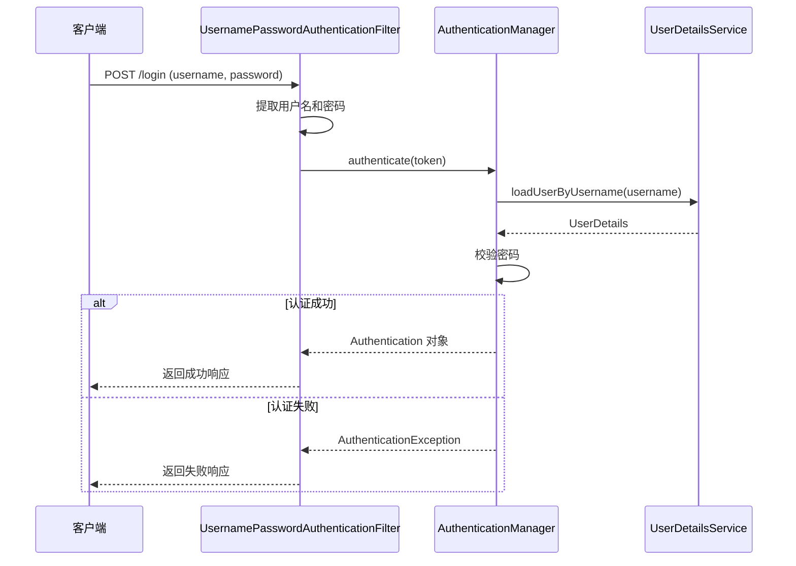
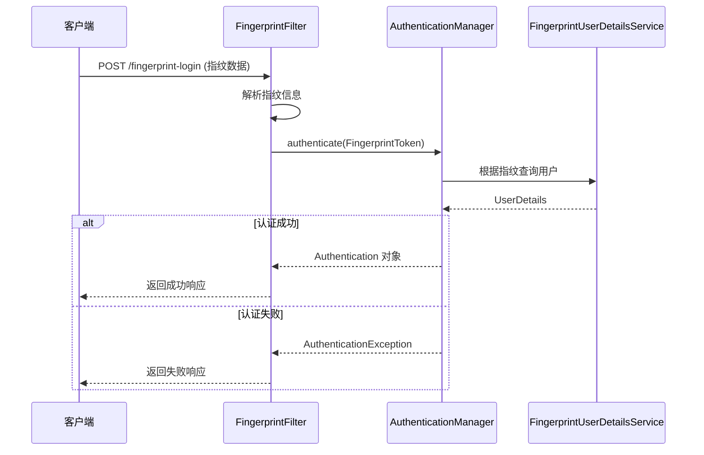

# Spring Security 鱼池工

本项目演示了三种 Spring Security 认证方式。

## 功能分支

| 分支 | 说明 |
|---|---|
| feature/exist | Spring Security 对接已经存在项目 |
| feature/username-filter | 采用 UsernamePasswordAuthenticationFilter 实现登录 |
| feature/finger-print | 指纹登录 |

---

## 1. 标准表单登录流程（feature/exist）

```mermaid
sequenceDiagram
    participant 客户端
    participant Spring Security
    participant UserDetailsService
    participant 数据库

    客户端->>Spring Security: POST /api/login (account, password)
    Spring Security->>UserDetailsService: loadUserByUsername(account)
    UserDetailsService->>数据库: 查询用户信息
    数据库-->>UserDetailsService: 返回用户数据
    UserDetailsService-->>Spring Security: UserDetails
    Spring Security->>Spring Security: 校验密码
    alt 认证成功
        Spring Security-->>客户端: 跳转到受保护资源
    else 认证失败
        Spring Security-->>客户端: 跳转回登录页（含错误信息）
    end
```

---

## 2. UsernamePasswordAuthenticationFilter 登录流程（feature/username-filter）

---

## 3. 指纹登录流程（feature/finger-print）

